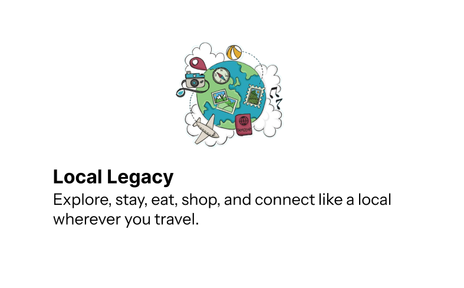

# LocalLegacy

A travel discovery and planning platform that helps users explore destinations, find places to stay, eat, explore, and shop, connect with local guides, save favourite places, and get recommendations based on their budget.

## Preview



## Live Demo

🔗 [LocalLegacy – Live Website](https://locallegacy.vercel.app/)

## Features

- Explore destinations by country and city
- Discover places under **Stay, Eat, Do, and Shop**
- View detailed information about destinations
- Find local travel guides
- Save favourite places
- Plan trips based on budget
- Personalized recommendations
- User signup and login
- Google sign-in
- Password reset
- Firebase Authentication
- Cloud Firestore for user data and saved places
- Guest browsing option

## Getting Started

This project was built with **Create React App, React Router, and Firebase**.

In the project directory, you can run:

### `npm install`

Installs all the required project dependencies.

### `npm start`

Runs the app in development mode.

Open [http://localhost:3000](http://localhost:3000) to view it in your browser.

The page will reload automatically when you make changes.

### `npm run build`

Builds the app for production in the `build` folder.

## Project Structure

```text
public/
├── index.html
├── pictures/
└── profile_pictures/

src/
├── index.js
├── App.js
├── App.css
├── index.css
├── AppContext.js
├── auth.js
├── firebase.js
│
├── components/
│   ├── Entry.js
│   ├── Login.js
│   ├── Signup.js
│   ├── ResetPassword.js
│   ├── Home.js
│   ├── Detail.js
│   ├── Save.js
│   ├── Trip.js
│   ├── Profile.js
│   ├── Navbar.js
│   ├── SearchBar.js
│   ├── CategoryTabs.js
│   ├── ListingCard.js
│   ├── GuideCard.js
│   └── ...
│
└── data/
    ├── businesses.js
    ├── guides.js
    ├── trips.js
    ├── cities.js
    └── destinations/
